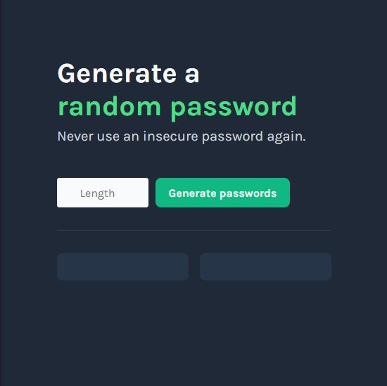
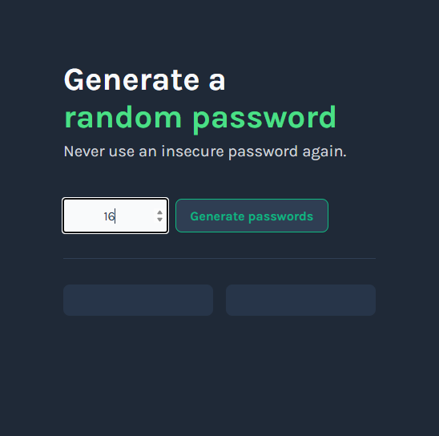
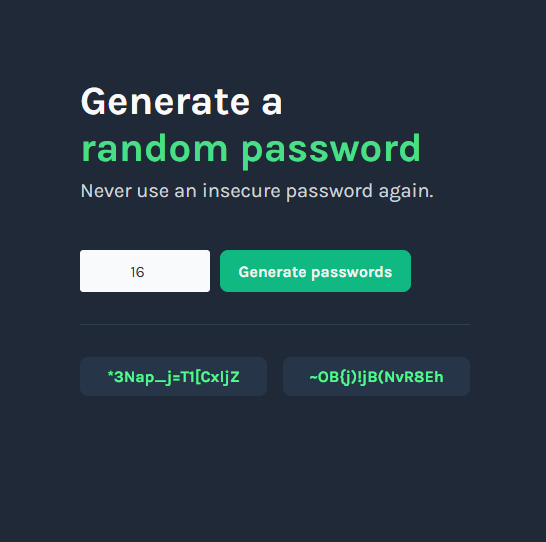

# 🔐 Password Generator  
**Scrimba Solo Project (PRO)**

A sleek and simple **Password Generator** built as part of the Scrimba Frontend Career Path.  
The project focuses on practicing **JavaScript logic**, **DOM manipulation**, and **UI interaction**.

---

## 🚀 Features

- Generate strong random passwords  
- Adjustable password length  
- One-click copy to clipboard
  
---

## 🖼️ Preview

<p align="center">
  
  
  
</p>

---

## 🧠 What I Learned

- Generating random strings using JavaScript  
- Handling button click events  
- Updating the DOM to display generated passwords  
- Working with clipboard API (`navigator.clipboard.writeText`)  
- Styling UI elements with CSS for a modern feel  

---

## 📦 Tech Stack

- **HTML5**  
- **CSS3**  
- **JavaScript (ES6+)**  

---

## 💻 How to Use

1. Enter your desired **password length**  
2. Click **Generate Password**  
3. Click on a password to **copy it to your clipboard**  
4. Use it anywhere you need a secure password

---

## 📁 Running Locally

1. Clone this repository:
   ```bash
   git clone https://github.com/hdnexus/scrimba-password-generator-project.git
